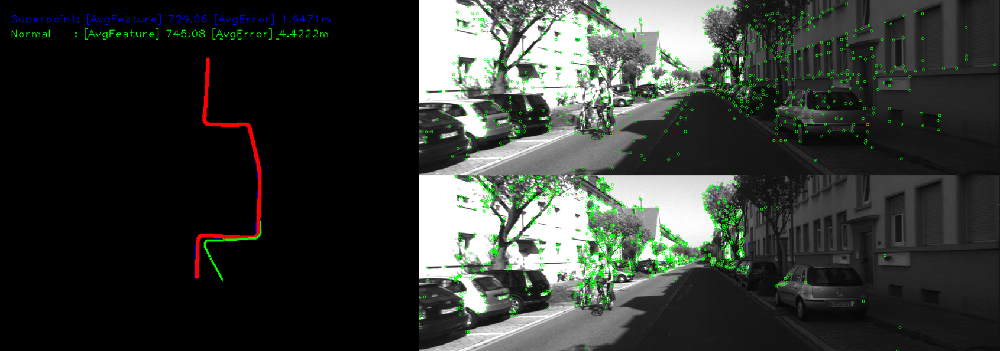
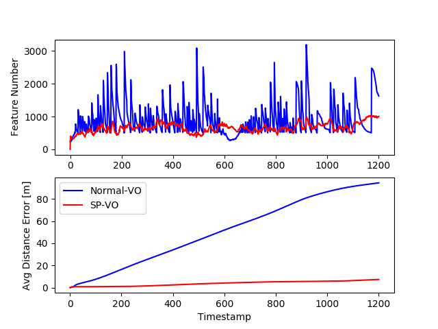
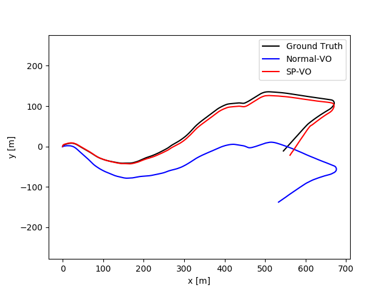

## SuperPoint-Visual Odometry (SP-VO)
### Abstract
This Visual Odometry is a combination between 
[monoVO-python](https://github.com/uoip/monoVO-python) and [SuperPointPretrainedNetwork](https://github.com/MagicLeapResearch/SuperPointPretrainedNetwork).

### Requirements
* Python 3.5
* Numpy
* [OpenCV](https://opencv.org/) python >= 3.4
* [Pytorch](https://pytorch.org/) >= 0.4

### Dataset
[KITTI odometry data set (grayscale, 22 GB)](http://www.cvlibs.net/datasets/kitti/eval_odometry.php)

### Pretrained model for SuperPoint
[SuperPointPretrainedNetwork (superpoint_v1.pth)](https://github.com/MagicLeapResearch/SuperPointPretrainedNetwork)

### Usage
#### Exec Visual Odometry
Modify the path and Sequence_Num in main.py to your image sequences and ground truth trajectories, then run
```
python main.py
```
VO Process is visualized in 2 screen (Trajectory and Feature extraction (up:SP-VO, down:Normal-VO))

 

#### Visualizer
Modify the path in result_visualizer.py to your output ("kitti_XX.txt")
```
python result_visualizer.py
```
Visualized example is following.

 

### References
* [monoVO-python](https://github.com/uoip/monoVO-python)
* [SuperPointPretrainedNetwork](https://github.com/MagicLeapResearch/SuperPointPretrainedNetwork)
* [Monocular Visual Odometry using OpenCV](http://avisingh599.github.io/vision/monocular-vo/) and its related project report [Monocular Visual Odometry](http://avisingh599.github.io/assets/ugp2-report.pdf) | Avi Singh